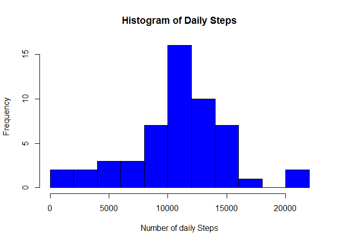
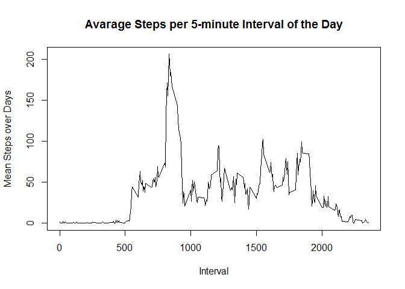
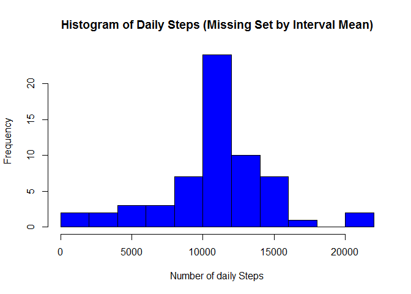
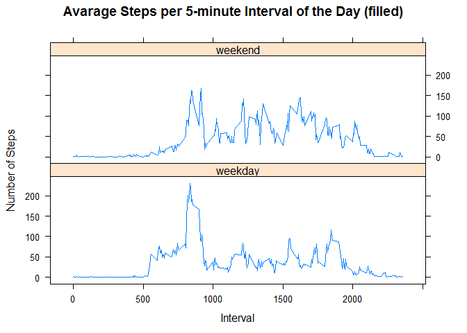

# Reproducible Research: Peer Assessment 1


## Setup

First let's load the libraries that we'll be using.

```r
# Sometimes these give warning message (not shown)
library(dplyr)
library(lattice)
```


## Loading and preprocessing the data

If the data is not already downloaded, it may be obtained 
[here](https://d396qusza40orc.cloudfront.net/repdata%2Fdata%2Factivity.zip).

If not already, rename the downloaded archive to activity.zip

Unpack the zip file and load the data:

```r
unzip("activity.zip")
activity <- read.csv("activity.csv", colClasses = c("integer", "Date", "integer"))
```
There are a total of 17,568 observations in this dataset with the following variables
The variables included in this dataset are:

- steps: Number of steps taking in a 5-minute interval (missing values are coded as NA)

- date: The date on which the measurement was taken in YYYY-MM-DD format

- interval: Identifier for the 5-minute interval in which measurement was taken

```r
str(activity)
```

```
## 'data.frame':	17568 obs. of  3 variables:
##  $ steps   : int  NA NA NA NA NA NA NA NA NA NA ...
##  $ date    : Date, format: "2012-10-01" "2012-10-01" ...
##  $ interval: int  0 5 10 15 20 25 30 35 40 45 ...
```

## What is mean total number of steps taken per day?
First lets create a data frame with the number of steps summed for each day

```r
daily_steps <- activity %>% filter(!is.na(steps)) %>% group_by(date) %>% summarize(steps=sum(steps))
daily_steps
```

```
## Source: local data frame [53 x 2]
## 
##          date steps
## 1  2012-10-02   126
## 2  2012-10-03 11352
## 3  2012-10-04 12116
## 4  2012-10-05 13294
## 5  2012-10-06 15420
## 6  2012-10-07 11015
## 7  2012-10-09 12811
## 8  2012-10-10  9900
## 9  2012-10-11 10304
## 10 2012-10-12 17382
## ..        ...   ...
```
Let's look at the distribution of those totals:

```r
hist(daily_steps$steps, col = "blue", breaks = 15,
     xlab = "Number of daily Steps", main="Histogram of Daily Steps")
```

 

By this diagram, it appears that the mean is likely to fall somewhere near 10,000 steps.

```r
daily_stats <- daily_steps %>% summarise(mean=mean(steps), median=median(steps))
daily_stats
```

```
## Source: local data frame [1 x 2]
## 
##       mean median
## 1 10766.19  10765
```

## What is the average daily activity pattern?
Compute average steps for each 5 minute interval

```r
interval_means <- activity %>% group_by(interval) %>% summarise(mean = mean(steps, na.rm = TRUE))
str(interval_means)
```

```
## Classes 'tbl_df', 'tbl' and 'data.frame':	288 obs. of  2 variables:
##  $ interval: int  0 5 10 15 20 25 30 35 40 45 ...
##  $ mean    : num  1.717 0.3396 0.1321 0.1509 0.0755 ...
##  - attr(*, "drop")= logi TRUE
```
Take a look as a time series plot.

```r
plot(interval_means, type="l", 
     xlab="Interval",
     ylab="Mean Steps over Days",
     main="Avarage Steps per 5-minute Interval of the Day")
```

 

Next, show the 5-minute interval, on average across all the days in the dataset, contains the maximum number of steps?

```r
interval_means[which.max(interval_means$mean),]
```

```
## Source: local data frame [1 x 2]
## 
##   interval     mean
## 1      835 206.1698
```

## Imputing missing values
Calculate and report the total number of missing values in the dataset (i.e. the total number of rows with NAs)

```r
sum(!complete.cases(activity))
```

```
## [1] 2304
```
Find out what columns that NA shows up in

```r
activity %>% summarise(naSteps=sum(is.na(steps)), 
                       naDates=sum(is.na(date)), 
                       naInterval=sum(is.na(interval)))
```

```
##   naSteps naDates naInterval
## 1    2304       0          0
```
Ok, they are all in the "steps" column.
Create a new dataset that is equal to the original dataset but with the missing data filled in.
We will set each NA to be the mean number of steps for the corresponding interval (averaged over days).
First split the set into two variables. One which contains all the rows with NA and the other which contains only complete rows.

```r
completeIdx <- complete.cases(activity)
missing <- activity[!completeIdx,]
complete<- activity[completeIdx,]
```
Then, merge the data frame with missing data with the interval_means data frame matching on the "interval" column.

```r
missing <- merge(x=missing, y=interval_means, by="interval")
```
Then overwrite the missing values from the mean column and recombine the newly filled frame with the rows from the complete data frame.

```r
filled <- missing %>% mutate(steps=mean) %>% select(steps, date, interval)
activity_filled <- rbind(complete, filled) %>% arrange(date, interval)
```
Show that the data set is still the same size

```r
str(activity_filled)
```

```
## 'data.frame':	17568 obs. of  3 variables:
##  $ steps   : num  1.717 0.3396 0.1321 0.1509 0.0755 ...
##  $ date    : Date, format: "2012-10-01" "2012-10-01" ...
##  $ interval: int  0 5 10 15 20 25 30 35 40 45 ...
```
and show that all the NAs have been filled

```r
activity_filled %>% summarise(naSteps=sum(is.na(steps)), 
                              naDates=sum(is.na(date)), 
                              naInterval=sum(is.na(interval)))
```

```
##   naSteps naDates naInterval
## 1       0       0          0
```

Distribution of daily steps with filled in values

```r
daily_steps_filled <- activity_filled %>% group_by(date) %>% summarize(steps=sum(steps, na.rm = TRUE))
hist(daily_steps_filled$steps, col = "blue", breaks = 15,
     xlab = "Number of daily Steps", main="Histogram of Daily Steps (Missing Set by Interval Mean)")
```

 

And the mean/median

```r
filled_daily_stats <- daily_steps_filled %>% summarise(mean=mean(steps), median=median(steps))
filled_daily_stats
```

```
## Source: local data frame [1 x 2]
## 
##       mean   median
## 1 10766.19 10766.19
```
Filling in the missing data increased the mean and median by:

```r
filled_daily_stats - daily_stats
```

```
##   mean   median
## 1    0 1.188679
```
The mean and median calculated with NA values removed is essentially the same as when replacing the NA values with the average steps for the time interval.

## Are there differences in activity patterns between weekdays and weekends?
Create a new factor variable in the dataset with two levels -- "weekday" and "weekend" indicating whether a given date is a weekday or weekend day.

```r
dayType <- sapply(weekdays(activity_filled$date), 
                  function(x){ 
                      if(x %in% c("Saturday", "Sunday"))
                          "weekend"
                      else
                          "weekday"
                      })
dayType <- data.frame(factor(dayType))
colnames(dayType) <- "dayType"
activity_filled <- cbind(activity_filled, dayType)
str(activity_filled)
```

```
## 'data.frame':	17568 obs. of  4 variables:
##  $ steps   : num  1.717 0.3396 0.1321 0.1509 0.0755 ...
##  $ date    : Date, format: "2012-10-01" "2012-10-01" ...
##  $ interval: int  0 5 10 15 20 25 30 35 40 45 ...
##  $ dayType : Factor w/ 2 levels "weekday","weekend": 1 1 1 1 1 1 1 1 1 1 ...
```
Make a panel plot containing a time series plot of the 5-minute interval (x-axis) and the average number of steps taken, averaged across all weekday days or weekend days (y-axis).

```r
interval_means_by_dayType <- activity_filled %>% group_by(interval, dayType) %>% 
                                summarise(steps = mean(steps))
xyplot(steps ~ interval | dayType, data = interval_means_by_dayType, 
       layout = c(1, 2), type="l", 
       xlab="Interval", ylab="Number of Steps", 
       main="Avarage Steps per 5-minute Interval of the Day (filled)")
```

 
